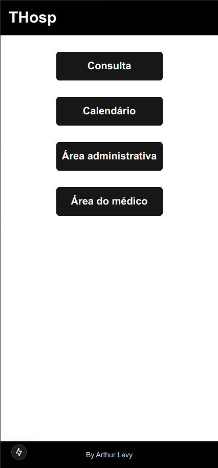
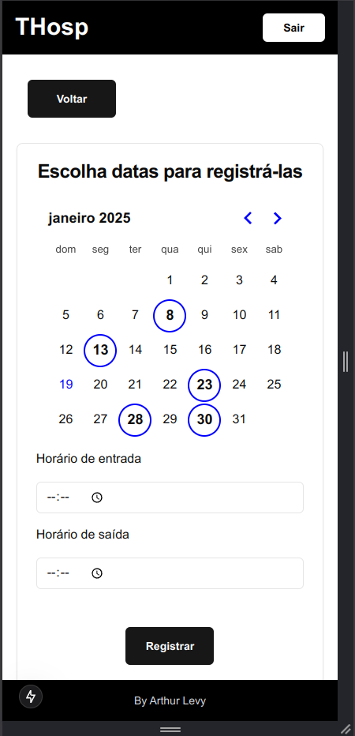
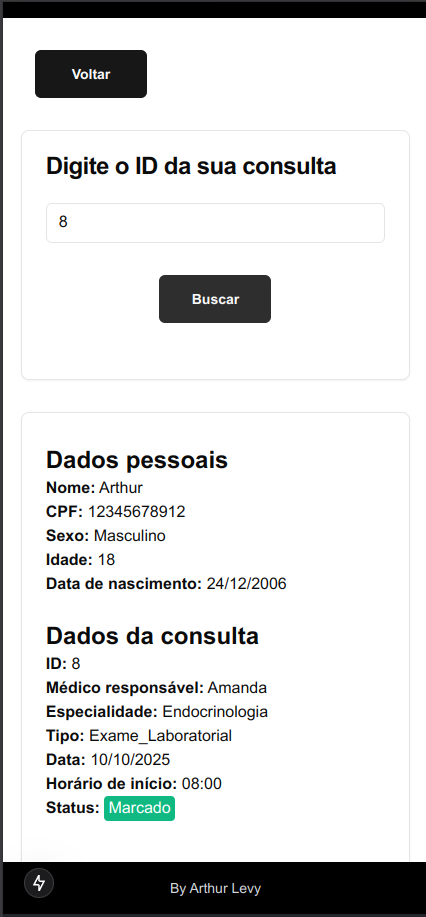
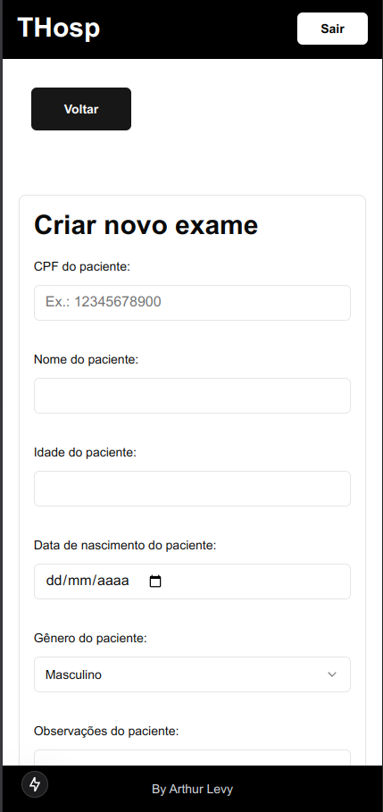

[PORTUGUÊS]

# Tech Hospital
O Tech Hospital é uma uma solução que pensei para um problema que passei enquanto tentava marcar uma consulta em um hospital público. <br>
Mesmo indo presencialmente para o hospital e ligando para obter informações, não sabia qual em qual data teria que ir para marcar uma consulta para um médico em específico e também não tinham previsões de quando teriam datas disponíveis. Para isso, criei esta solução. 

## Funcionalides
- Pacientes do hospital podem consultar em quais datas e horários os médicos estarão disponíveis
- Os pacientes podem visualizar como está o andamento de alguma solicitação de consulta, exame, entre outros, podendo ver qual médico será responsável, qual data, se está agendado ou indeferido, entre outras informações
- Os médicos possuem sua área para o registro de datas e horas disponíveis
- A administração do hospital possui sua área para a marcação de exames e outros procedimentos oferecidos pelo hospital

## Mídias do projeto
Página inicial <br>
 <br><br>
Tela de calendário de datas <br>
 <br><br>
Tela de consulta <br>
 <br><br>
Tela cadastramento de exames <br>
 <br><br>

## Stack
- TypeScript
- Next.Js com ShadCn e TailwindCss

## Como rodar o projeto
1. Clone o projeto em seu local de preferência
```bash
git clone git@github.com:Arthur-Llevy/Tech-hospital.git
```

<br>

2. Baixe as dependências
```bash
npm install
```

<br>

3. Rode o projeto
```bash
npm run dev
```

***Outros gerenciadores também podem ser utilizados para isso, como o yarn.***
<br>

Obrigado pela atenção!


[ENGLISH]

#Technological Hospital
Tech Hospital is a solution I thought of for a problem I had while trying to schedule an appointment at a public hospital. <br>
Even though I went to the hospital in person and called to get information, I didn't know which data I would need to enter to schedule an appointment with a specific doctor and I also didn't know when the data would be available. That's why I created this solution.

## Functionalities
- Hospital patients can check the data and times when doctors will be available
- Patients can view the progress of any request for an appointment, exam, among others, and can see which doctor is responsible, what data, whether it is scheduled or denied, among other information
- Doctors have their own area to record data and available times
- The hospital administration has its own area to schedule exams and other procedures offered by the hospital

## Medias of the project
Initial page <br>
 <br><br>
Calendar page <br>
 <br><br>
Exam consultation screen <br>
 <br><br>
Exam registration screen <br>
 <br><br>

## Stack
- TypeScript
- Next.Js with ShadCn and TailwindCss

## How to run the project
1. Clone the project to your preferred location
```bash
git clone git@github.com:Arthur-Llevy/Tech-hospital.git
```

<br>

2. Download the dependencies
```bash
npm install
```

<br>

3. Run the project
```bash
npm run dev
```

***Other managers can also be used for this, such as yarn.***
<br>